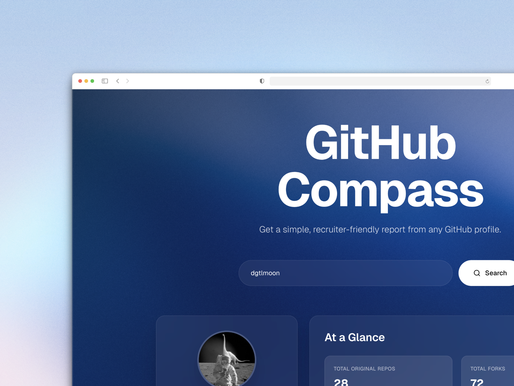

# 🧭 GitHub Compass

I got the ick from guessing, so I built **GitHub Compass** — a tool that shows you what developers *actually* built.


---

## What It Does

Enter a GitHub username → Get the real stats.

✅ **Original Repos vs. Forks** — See what they built vs. what they cloned  
✅ **Real Language Usage** — Based only on their original projects  
✅ **Key Metrics** — Stars, PRs, gists, and actual activity

No fluff. Just signal.

---

## Why This Exists

**The Problem:** Recruiters waste time trying to figure out if a GitHub profile is legit or just for show.

**The Solution:** GitHub Compass filters out the noise and shows you what matters.

**The Flex:** Built with Next.js, React, TypeScript, and GitHub API — the same tech stack you're hiring for 💅

---

## Quick Start

```bash
# Clone & install
git clone https://github.com/yourusername/github-compass.git
cd github-compass
npm install

# Run it
npm run dev
```

Open [http://localhost:3000](http://localhost:3000)

### Optional: GitHub Token

For higher rate limits (5000/hour vs 60/hour):

```bash
cp .env.local.example .env.local
# Add your token to .env.local
GITHUB_TOKEN=your_token_here
```

---

## Tech Stack

- **Next.js 14+** — App Router, Server Components
- **TypeScript** — Type safety
- **Tailwind CSS** — Styling
- **GitHub API** — Data source

---

## What Makes It Different

**For Recruiters:**
- No more guesswork — see original work vs. forks instantly
- Real skills — language stats from actual code
- Time saver — analyze profiles in seconds

**For Developers:**
- Showcase real work — your original projects highlighted
- Fair assessment — forks don't dilute your stats
- Clean presentation — modern, professional UI

---

## Security

This repo is protected with:
- ✅ Branch protection rules
- ✅ Automated security audits
- ✅ Dependabot alerts
- ✅ No secrets in code (server-side API)

See [SECURITY.md](./SECURITY.md) for details.

---

- **The Live Demo:** [Github Compass](https://github-compass.vercel.app)

---

Made with 💙 for recruiters who deserve better tools :)

